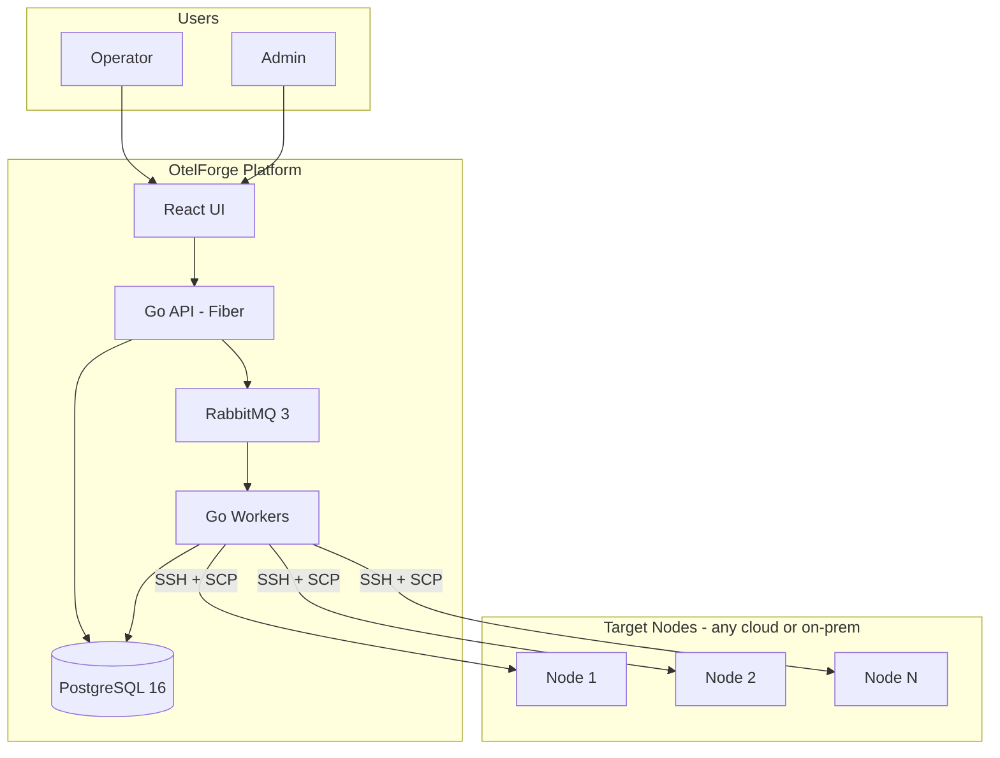
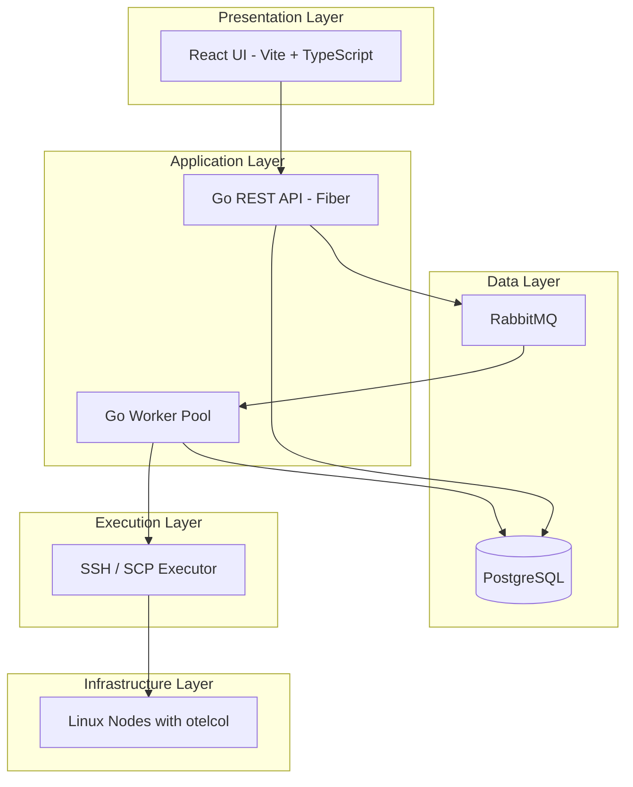
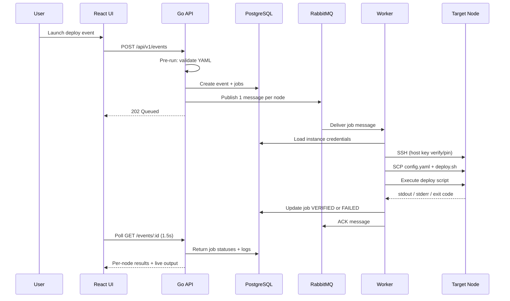
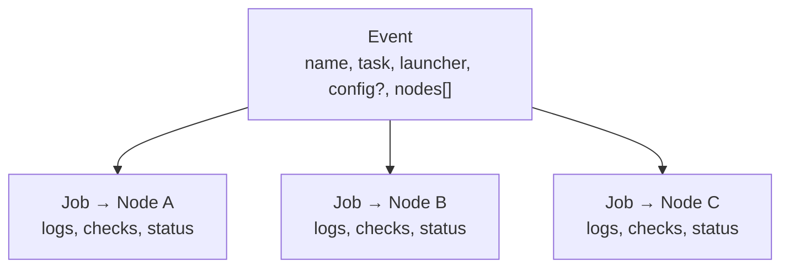

# OtelForge — Architecture & Product Guide

**Version:** 1.0 (implemented)  
**Last updated:** July 2026

OtelForge is an internal web platform for deploying and managing OpenTelemetry Collector configurations across SSH-reachable Linux nodes. Operators register nodes, launch **events** against one or many targets, and track per-node verification results and logs. Admins audit all activity.

---

## Table of Contents

1. [Executive Summary](#1-executive-summary)
2. [Problem Statement](#2-problem-statement)
3. [Solution Overview](#3-solution-overview)
4. [What This Is — and What It Is Not](#4-what-this-is--and-what-it-is-not)
5. [Cloud & AWS Positioning](#5-cloud--aws-positioning)
6. [System Architecture](#6-system-architecture)
7. [Repository Layout](#7-repository-layout)
8. [Components](#8-components)
9. [Data Model](#9-data-model)
10. [REST API](#10-rest-api)
11. [User Roles & Access Control](#11-user-roles--access-control)
12. [User Flows](#12-user-flows)
13. [Predefined Tasks](#13-predefined-tasks)
14. [Events & Jobs](#14-events--jobs)
15. [Verification & Rollback](#15-verification--rollback)
16. [Message Queue Design](#16-message-queue-design)
17. [Security Model](#17-security-model)
18. [UI Pages](#18-ui-pages)
19. [Local Development & Operations](#19-local-development--operations)
20. [Known Limitations](#20-known-limitations)
21. [Roadmap](#21-roadmap)
22. [FAQ](#22-faq)

---

## 1. Executive Summary

OtelForge is a cloud-agnostic web platform for deploying and managing OpenTelemetry Collector configurations across many Linux nodes. Operators register SSH-accessible servers, upload `config.yaml` files, launch **events** against one or many targets, and track per-node verification results and logs.

The platform uses **SSH + SCP** to push configuration and run **predefined, audited scripts** on remote machines. It does **not** require AWS, IAM roles, SSM Agent, or a custom agent installed on target nodes.

**Key value:**

- Purpose-built for OpenTelemetry config lifecycle (deploy, validate, restart, rollback, logs, install)
- Multi-node batch operations with async job processing
- Live job output in the UI while events run
- Audit trail (who launched what, when, on which nodes)
- Pre-run and post-run verification with visible logs
- Works on **any SSH-reachable Linux node** (EC2, GCP, Azure, on-prem)

**Target scale (v1):** ~20 operators, ~50 nodes, Docker Compose on an internal VM.

---

## 2. Problem Statement

Teams running OpenTelemetry Collectors on dozens or hundreds of nodes face recurring operational pain:

| Pain | Today (manual) | With OtelForge |
|------|----------------|----------------|
| Config rollout | SSH into each box, copy file, restart service | One event → N nodes |
| Validation | Easy to skip `otelcol validate` | Built into every deploy |
| Audit | No central record of who changed what | Launcher name/email on every event |
| Partial failures | Hard to see which nodes failed | Per-node job status + logs |
| Rollback | Manual restore from memory/backups | One-click per node or whole event |
| Tooling sprawl | Ansible playbooks, bash scripts, spreadsheets | Single UI + API |

Generic tools like **AWS SSM** or **Ansible** can solve parts of this, but they are general-purpose. OtelForge is **opinionated and OTel-specific**, with verification, rollback, and audit built in.

---

## 3. Solution Overview



**How a deploy works (high level):**

1. User logs in and registers nodes (host, SSH credentials — password or private key).
2. User launches an event: uploads `config.yaml`, selects target nodes.
3. API validates input, creates event + jobs, enqueues work in RabbitMQ.
4. Workers pick up jobs, connect over SSH (with host-key pinning), SCP config + predefined script, execute remotely.
5. Worker runs pre/post verification checks, stores logs, updates job status.
6. User views Event Detail: live polling, per-node pass/fail, stdout/stderr, rollback if needed.

---

## 4. What This Is — and What It Is Not

### What OtelForge IS

| Description |
|-------------|
| An **OpenTelemetry config deployment platform** |
| A **batch orchestration tool** for collector operations |
| **Cloud-agnostic** — any SSH-reachable Linux node |
| An **audit-friendly** system (launcher identity on every event) |
| A **safe-by-design** executor (predefined scripts only, no arbitrary shell from users) |

### What OtelForge IS NOT

| Misconception | Reality |
|---------------|---------|
| Replacement for **AWS SSM** | No — SSM is general AWS ops (patching, inventory, Session Manager, etc.) |
| Replacement for **Ansible/Terraform** | No — those are full IaC/automation frameworks |
| AWS-only tool | No — works anywhere SSH works |
| Requires agent on nodes | No — only SSH server + otelcol on the target (install task can bootstrap otelcol) |
| Requires AWS IAM | No — connectivity is SSH, not AWS API |

### Comparison: OtelForge vs AWS SSM

| Capability | OtelForge | AWS SSM |
|------------|-----------|---------|
| Primary transport | SSH + SCP | SSM Agent + AWS API |
| AWS IAM required | No | Yes |
| OTel-specific UI & workflows | Yes | No (build yourself) |
| Config deploy + validate + restart | Built-in | Custom Run Command |
| Rollback with backup | Built-in | Custom |
| Per-event audit (name/email) | Built-in | CloudTrail (different model) |
| Works on non-AWS nodes | Yes | No |
| Works on AWS EC2 | Yes (via SSH) | Yes (native) |

**Interview one-liner:**

> "OtelForge is not an SSM replacement — it's a purpose-built OpenTelemetry deployment tool that happens to work on AWS EC2 the same way it works on any SSH node."

---

## 5. Cloud & AWS Positioning

### Cloud-agnostic by design

Target nodes are identified by **network endpoint + SSH credentials**, not by cloud provider:

```
host: 10.0.1.50        (private IP)
host: 203.0.113.10     (public IP)
host: prod-api.internal (DNS)
```

Supported targets include AWS EC2, GCP, Azure VMs, on-prem servers, bare metal — any Linux host with `sshd`.

### Connecting to AWS without IAM

The platform **does not call AWS APIs**. It connects to the **machine**, not the **cloud control plane**.

**What you need on a target node:**

| Requirement | Purpose |
|-------------|---------|
| SSH reachable (security group / network) | Worker can connect |
| OS user + password **or** private key | Authentication |
| OpenTelemetry Collector installed (or use Install OTel Agent task) | Deploy/validate/restart tasks |
| `sudo` for collector paths | Copy config, manage systemd service |

**What you do NOT need:** IAM instance profile for OtelForge, SSM Agent, service-linked roles, or AWS credentials in the platform.

Default EC2 AMIs typically use SSH keys — supported via the instance create/update API (`privateKey` field).

---

## 6. System Architecture

### Layered view



### Request lifecycle (deploy event)



### Why async (RabbitMQ)?

| Benefit | Explanation |
|---------|-------------|
| Fast API response | User gets `QUEUED` immediately |
| Reliability | Jobs survive API/worker crashes |
| Retries | Requeue failed nodes (capped) without re-running whole batch |
| Scaling | Add workers via `WORKER_CONCURRENCY` |
| Isolation | One hung SSH connection blocks one worker, not the API |

---

## 7. Repository Layout

```
OtelForge/
├── ARCHITECTURE.md          # This document
├── README.md                # Quick start only
├── docker-compose.yml       # postgres, rabbitmq, api, worker, web
├── .env.example             # JWT_SECRET, ENCRYPTION_KEY, etc.
├── api/
│   ├── cmd/server/          # Fiber REST API entrypoint
│   └── internal/handlers/   # HTTP handlers
├── worker/
│   ├── cmd/worker/          # RabbitMQ consumer entrypoint
│   └── internal/runner/     # SSH job execution
├── internal/                # Shared packages
│   ├── auth/                # JWT middleware
│   ├── config/              # Env loading
│   ├── crypto/              # AES-256-GCM for SSH secrets
│   ├── db/                  # PostgreSQL store + migrations
│   ├── events/              # Event creation service
│   ├── models/              # Domain types
│   ├── queue/               # RabbitMQ publish/consume
│   ├── ssh/                 # SSH client + host-key pinning
│   └── tasks/               # Script name → embedded bash mapping
├── web/                     # React + Vite UI
│   └── src/
│       ├── pages/           # Route pages
│       ├── components/      # EventLivePanel, JobTimeline, etc.
│       └── hooks/           # useEventPolling
├── scripts/bash/            # Platform-owned remote scripts
└── cmd/seed/                # CLI to create users
```

---

## 8. Components

### React UI (`web/`)

- Vite + TypeScript SPA
- JWT stored in `localStorage` (see [Known Limitations](#20-known-limitations))
- Event detail polls every **1.5s** while jobs are active (`useEventPolling`)
- Live log console shows worker activity and stdout/stderr per job
- Stale `QUEUED` warning when worker appears down

### Go API (`api/`)

- **Fiber** REST API at `/api/v1`
- Authentication (JWT), authorization (user vs admin)
- CRUD: instances, events
- Pre-run validation (YAML syntax, ownership)
- Publishes one RabbitMQ message per job
- Never returns decrypted SSH passwords or private keys

### Go Worker (`worker/`)

- Consumes job messages from RabbitMQ (prefetch 1, separate AMQP channel per consumer)
- Decrypts SSH credentials in memory only
- SSH host-key **TOFU pinning** on first connect; rejects mismatches thereafter
- Executes predefined bash scripts over SSH/SCP
- Runs pre/post verification checks
- Writes job results + incremental activity to PostgreSQL
- ACK after successful DB update; NACK with retry cap (3 attempts → DLQ)

### PostgreSQL

Persistent storage for users, instances (encrypted credentials + host key fingerprint), events, jobs, and job checks.

Migrations in `internal/db/migrations/`:

| Migration | Purpose |
|-----------|---------|
| `001_initial.sql` | Core schema |
| `002_ssh_private_key.sql` | `ssh_private_key_enc` column |
| `003_ssh_host_key_fingerprint.sql` | Host key fingerprint for TOFU pinning |

### RabbitMQ

Async job queue between API and workers. One message per node per event. Dead-letter queue for exhausted retries.

### Target Node (no OtelForge agent)

Only standard services:

- `sshd` (SSH server)
- `otelcol` (OpenTelemetry Collector — installable via task)
- `systemd` (service management)

---

## 9. Data Model

### Users

| Column | Description |
|--------|-------------|
| `id` | UUID |
| `email` | Unique login |
| `password_hash` | bcrypt |
| `role` | `user` or `admin` |

### Instances

| Column | Description |
|--------|-------------|
| `id` | UUID |
| `owner_id` | Creating user |
| `name`, `host`, `port`, `ssh_user` | Connection info |
| `ssh_password_enc` | AES-256-GCM encrypted password (optional if key used) |
| `ssh_private_key_enc` | AES-256-GCM encrypted PEM (optional if password used) |
| `ssh_host_key_fingerprint` | SHA256 host key pin (set on first successful connect) |

### Events

| Field | Description |
|-------|-------------|
| `id` | UUID |
| `name` | User-given title |
| `launcherName`, `launcherEmail` | Audit fields |
| `ownerId` | User who created it |
| `taskType` | Predefined task enum |
| `configContent` | YAML text (if task requires config) |
| `configChecksum` | Integrity hash |
| `status` | `QUEUED` → `RUNNING` → `COMPLETED` \| `PARTIAL` \| `FAILED` |
| `relatedEventId` | For rollback/re-run (optional) |
| `rollbackScope` | `instance` or `all` (optional) |
| `totalJobs`, `verifiedCount`, `failedCount` | Aggregates |

### Jobs

| Field | Description |
|-------|-------------|
| `eventId` | Parent event |
| `instanceId` | Target node |
| `status` | `QUEUED` → `RUNNING` → `VERIFIED` \| `FAILED` |
| `checks[]` | `{ phase, name, passed, message }` |
| `stdout` / `stderr` | Remote command output (updated live during run) |
| `exitCode` | Script exit code |
| `startedAt` / `finishedAt` | Timestamps |

---

## 10. REST API

Base path: `/api/v1`  
Auth: `Authorization: Bearer <jwt>` on protected routes.

| Method | Path | Auth | Description |
|--------|------|------|-------------|
| GET | `/health` | — | Liveness (`ok`) |
| POST | `/auth/login` | — | Email/password → JWT |
| GET | `/instances` | user | List own instances |
| POST | `/instances` | user | Create instance |
| POST | `/instances/bulk` | user | Bulk CSV import |
| PUT | `/instances/:id` | user | Update instance |
| DELETE | `/instances/:id` | user | Delete instance |
| GET | `/events` | user | List own events |
| POST | `/events` | user | Create event + enqueue jobs |
| GET | `/events/:id` | user | Event detail + jobs |
| POST | `/events/:id/rerun-failed` | user | Re-queue failed jobs |
| POST | `/events/:id/clone` | user | Clone event metadata |
| POST | `/events/:id/jobs/:jobId/rollback` | user | Rollback single job |
| GET | `/admin/events` | admin | All events (filters) |
| GET | `/admin/instances` | admin | All instances |

---

## 11. User Roles & Access Control

| Role | Instances | Events | Logs | Admin views |
|------|-----------|--------|------|-------------|
| **User** | CRUD own | Create/view own | Own events only | No |
| **Admin** | View all | View all | All events | Filters by launcher, status, date |

**Authentication:** email + password → JWT session token.

**Audit fields on every event:** `launcherName`, `launcherEmail` — auto-filled from login, editable before submit.

Users are seeded via `cmd/seed` (no self-service registration in v1).

---

## 12. User Flows

### Core deploy flow

1. Login with email/password
2. Register node — name, host, port, SSH username, password **or** private key
3. Launch event — name, launcher details, task = Deploy OTel Config
4. Upload `config.yaml`
5. Select one or many nodes
6. Platform executes — backup, copy, validate, restart collector
7. Track live output, pre/post checks, and logs on Event Detail
8. Rollback if needed (per node or via rollback event)

### Bulk register nodes

Paste CSV → preview → save all → optionally launch SSH Connectivity Test.

**CSV format (bulk API):**

```csv
name,host,port,username,password
prod-api-1,10.0.1.10,22,ubuntu,secret
prod-api-2,10.0.1.11,22,ubuntu,secret
```

Bulk CSV is **password-only** today; use the single-instance form for PEM keys.

### Failed deploy recovery

- **Re-run failed instances** — same config, only `FAILED` jobs
- **Rollback** — per node via job action
- **Re-deploy** — new event with corrected config

### Clone / re-run event

Open past event → Clone → form pre-fills task, config, nodes, launcher → Launch (new event, original unchanged).

### Admin audit

Admin opens All Events / All Instances dashboards with filters by launcher email, status, task type, date range.

---

## 13. Predefined Tasks

All remote execution uses **platform-owned scripts** in `scripts/bash/`. Users cannot submit arbitrary shell commands.

| Task | `taskType` | Config? | Script | What it does |
|------|------------|---------|--------|--------------|
| Deploy OTel Config | `deploy_config` | Yes | `deploy.sh` | Backup → copy config → validate → restart → confirm active |
| Validate Config Only | `validate_config` | Yes | `validate.sh` | SCP config → `otelcol validate` only |
| Restart Collector | `restart_collector` | No | `restart.sh` | `systemctl restart otelcol` + confirm active |
| Check Status | `check_status` | No | `status.sh` | Report collector running/stopped state |
| Fetch Logs | `fetch_logs` | No | `logs.sh` | Tail `journalctl -u otelcol` |
| Rollback Config | `rollback_config` | No | `rollback.sh` | Restore `config.yaml.bak` → validate → restart |
| Stop Collector | `stop_collector` | No | `stop.sh` | `systemctl stop otelcol` |
| SSH Connectivity Test | `ssh_connectivity_test` | No | `ssh_test.sh` | SSH + `echo ok` |
| Install OTel Agent | `install_otel_agent` | No | `install.sh` | Download otelcol release (SHA256 verified) → install binary + systemd unit |

### Deploy script (excerpt)

```bash
set -euo pipefail
CONFIG_SRC="$1"
CONFIG_DEST="/etc/otelcol/config.yaml"
BACKUP="${CONFIG_DEST}.bak"

if [ -f "$CONFIG_DEST" ]; then
  sudo cp "$CONFIG_DEST" "$BACKUP"
fi

sudo cp "$CONFIG_SRC" "$CONFIG_DEST"
sudo otelcol validate --config="$CONFIG_DEST"
sudo systemctl restart otelcol
sudo systemctl is-active otelcol
```

---

## 14. Events & Jobs

An **event** is one user action (e.g. "deploy this config to these 5 nodes"). A **job** is one node's execution within that event.



Event status is derived from job outcomes:

- All jobs `VERIFIED` → `COMPLETED`
- Mix of verified/failed → `PARTIAL`
- All failed → `FAILED`

---

## 15. Verification & Rollback

### Verification phases

| Phase | Where | Checks |
|-------|-------|--------|
| **Pre-run (API)** | Before queue | Valid YAML syntax; user owns selected nodes |
| **Pre-run (worker)** | Before deploy | SSH connectivity |
| **Post-run (worker)** | After deploy | `otelcol validate`; restart success; `systemctl is-active`; log capture |

Each check is stored on the job and displayed in the UI as pass/fail with a message.

### Rollback model

Rollback is **per node** (each node has its own backup at `/etc/otelcol/config.yaml.bak`). Event-level rollback is a **batch action** over eligible nodes.

| Trigger | Scope | Behavior |
|---------|-------|----------|
| Rollback button on job row | Single node | Restore `.bak` → validate → restart |
| Rollback event | Selected nodes | Same rollback script per node |

---

## 16. Message Queue Design

### RabbitMQ topology

| Element | Value |
|---------|-------|
| Exchange | `otel.deploy` (direct) |
| Main queue | `deploy.jobs` (durable, DLX configured) |
| Dead-letter queue | `deploy.jobs.dlq` |
| Routing key | `job` (main), `dlq` (dead letter) |

### Message payload

```json
{
  "jobId": "...",
  "eventId": "...",
  "instanceId": "...",
  "taskType": "deploy_config"
}
```

### Reliability

| Setting | Value |
|---------|-------|
| Prefetch | 1 per consumer |
| Consumer channels | One AMQP channel per consumer goroutine |
| ACK | After PostgreSQL job update succeeds |
| Retry | NACK + requeue with `x-retry-count` header |
| Max attempts | 3 → route to DLQ |
| Failed job handling | Worker persists `FAILED` status then ACKs (no infinite requeue) |

---

## 17. Security Model

| Concern | Approach |
|---------|----------|
| User passwords | bcrypt hashed in PostgreSQL |
| SSH passwords / private keys | AES-256-GCM encrypted at rest (`ENCRYPTION_KEY`); never returned by API after save |
| SSH host keys | TOFU pin on first connect; SHA256 fingerprint stored; mismatch rejects connection |
| Session | JWT with expiry (`JWT_SECRET`) |
| Remote execution | Predefined scripts only — no arbitrary user shell |
| Authorization | Users access own resources; admin reads all |
| Transport | SSH to nodes; HTTPS for UI/API in production |
| Credential lifetime | Decrypted in worker memory only for duration of SSH session |
| Install script | `install.sh` verifies otelcol release SHA256 before install |
| Secrets in repo | `.env` gitignored; compose uses `env_file` |

---

## 18. UI Pages

| Page | Route | Purpose |
|------|-------|---------|
| Login | `/login` | Authentication |
| Instances | `/instances` | List, add, edit, delete nodes |
| Bulk Add | `/instances/bulk` | CSV import |
| Launch Event | `/launch` | Task picker, YAML editor, instance multi-select |
| Events List | `/events` | User's events; admin sees all |
| Event Detail | `/events/:id` | Live panel, job timeline, checks, logs, rollback, clone, re-run |
| Admin | `/admin` | All events/instances with audit filters |

Key components: `EventLivePanel`, `LiveLogConsole`, `JobTimeline`, `TaskPicker`, `YamlEditor`, `InstancePicker`.

---

## 19. Local Development & Operations

### Docker Compose services

| Service | Port | Notes |
|---------|------|-------|
| postgres | 5432 | DB `otelforge`, user/pass `otel` |
| rabbitmq | 5672, 15672 (mgmt) | user/pass `otel` |
| api | 8080 | `restart: unless-stopped` |
| worker | — | `WORKER_CONCURRENCY=2`, `restart: unless-stopped` |
| web | 5173 | Proxies API via `VITE_API_URL` |

### Required environment (`.env`)

| Variable | Purpose |
|----------|---------|
| `JWT_SECRET` | Sign JWTs |
| `ENCRYPTION_KEY` | 32 hex chars for AES-256-GCM |
| `DATABASE_URL` | PostgreSQL connection string |
| `RABBITMQ_URL` | AMQP connection string |
| `CORS_ORIGIN` | Allowed browser origin |

### Seed admin user

```bash
go run ./cmd/seed --email admin@internal.local --password changeme --role admin
```

### Operational notes

- Jobs stay **QUEUED** if the worker is not running: `docker compose up -d worker`
- Foreground `docker compose up` stops all services on Ctrl+C — use `-d` for background
- Worker must be healthy for any queued job to progress

---

## 20. Known Limitations

| Limitation | Notes |
|------------|-------|
| JWT in `localStorage` | XSS risk; httpOnly cookies recommended for production |
| Bulk CSV password-only | No PEM column; use single-instance API for keys |
| Delete instance FK | Delete fails if instance referenced by past events |
| No self-service registration | Users created via `cmd/seed` only |
| No bastion/jump host | Direct SSH only |
| No scheduled events | Manual launch only |

---

## 21. Roadmap

### Implemented (v1)

- 9 predefined tasks including Install OTel Agent
- SSH password + private key auth
- SSH host-key TOFU pinning
- RabbitMQ retry cap + DLQ
- Live event console with polling
- User/admin roles, bulk CSV, clone, re-run failed, per-job rollback
- Docker Compose stack with restart policies

### Planned (v2+)

- Bastion/jump host support
- Bulk CSV PEM column
- httpOnly cookie sessions
- Instance delete cascade or soft-delete
- Scheduled events (cron → RabbitMQ)
- SSO/LDAP
- Optional AWS SSM executor (pluggable alongside SSH)
- EC2 auto-discovery (requires IAM)

---

## 22. FAQ

**Is this a replacement for AWS SSM?**  
No. It is a focused OpenTelemetry deployment tool. SSM is a general AWS management platform.

**Does it only work on EC2?**  
No. Any SSH-reachable Linux node with otelcol installed (or installable via task).

**Do I need AWS IAM?**  
No. The platform connects via SSH, not AWS APIs.

**Do I need to install an agent on nodes?**  
No OtelForge agent. Only `sshd` and OpenTelemetry Collector (install task available).

**Can users run any bash command?**  
No. Only predefined, platform-owned scripts.

**Why RabbitMQ for a small fleet?**  
Reliability, retries, non-blocking API, and easy worker scaling as the fleet grows.

**What if deploy fails on 3 of 10 nodes?**  
Event status = `PARTIAL`. Re-run failed nodes, rollback one/all, or deploy fixed config.

**Why are jobs stuck in QUEUED?**  
The worker is likely not running. Start it with `docker compose up -d worker`.

---

*End of document*
