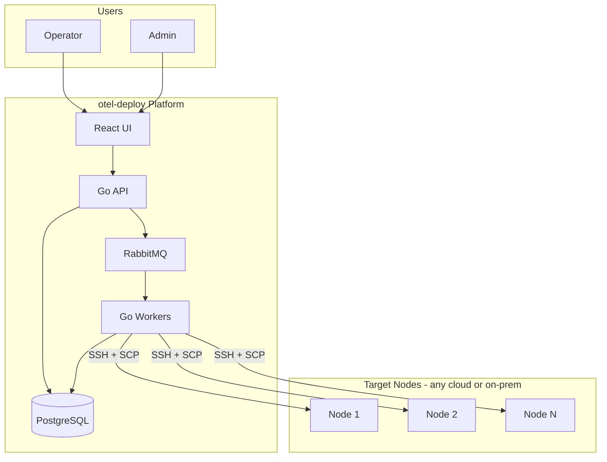
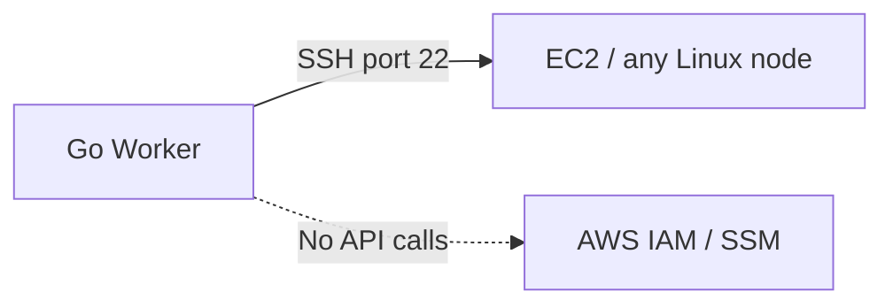
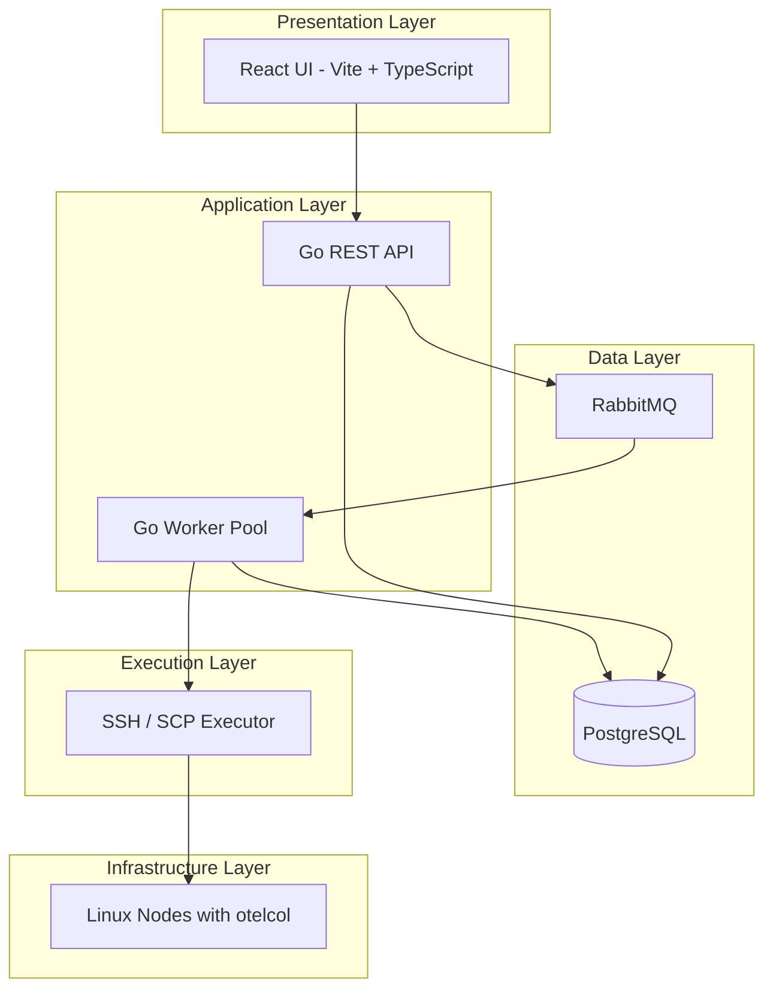
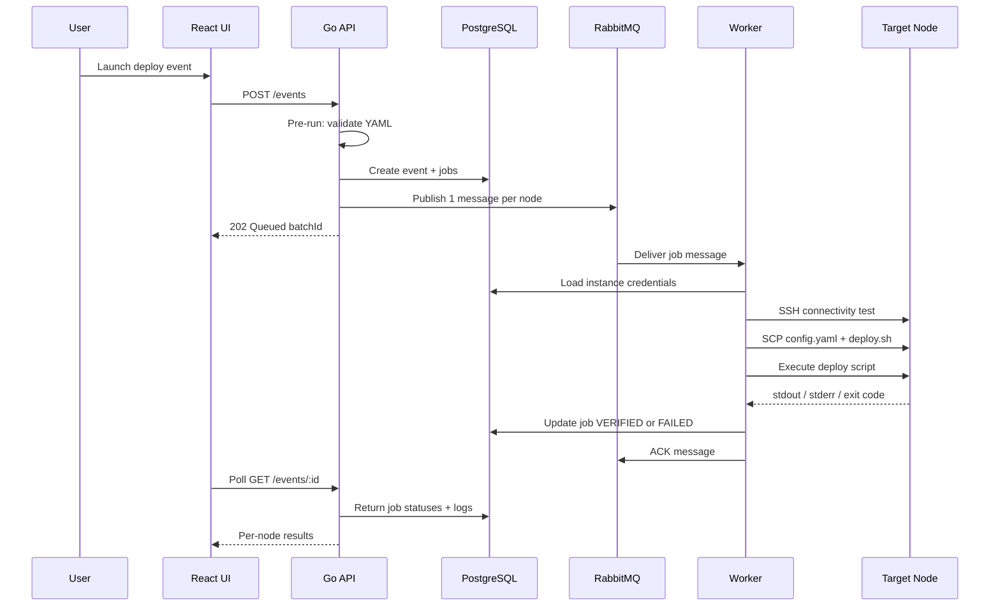
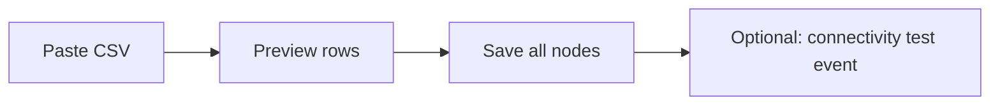
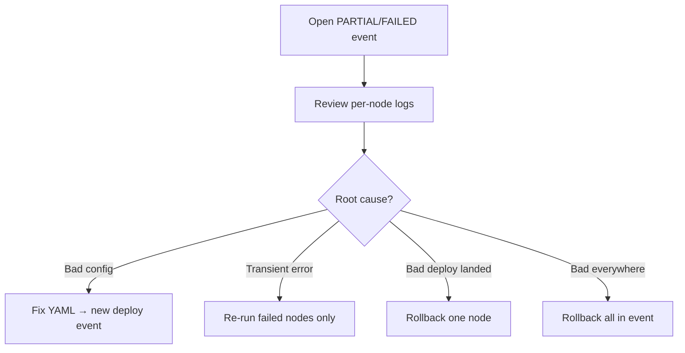
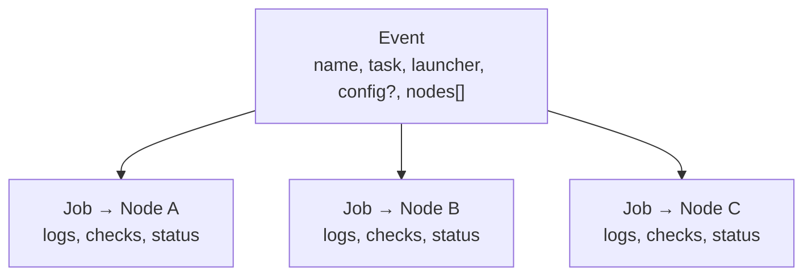

# otel-deploy — Architecture & Product Guide

**Version:** 1.1  
**Date:** July 26, 2026  
**Status:** Design approved — aligned to [v1 spec](../superpowers/specs/2026-07-26-otelforge-v1-design.md)

> **v1 decisions:** Internal tool (~20 operators, ~50 nodes). **PostgreSQL** (not MongoDB). Go monorepo. RabbitMQ retained. All 8 tasks, bulk CSV, clone event, user/admin roles, admin dashboard, per-node rollback.

---

## Table of Contents

1. [Executive Summary](#1-executive-summary)
2. [Problem Statement](#2-problem-statement)
3. [Solution Overview](#3-solution-overview)
4. [What This Is — and What It Is Not](#4-what-this-is--and-what-it-is-not)
5. [Cloud & AWS Positioning](#5-cloud--aws-positioning)
6. [System Architecture](#6-system-architecture)
7. [Components](#7-components)
8. [User Roles & Access Control](#8-user-roles--access-control)
9. [User Flows](#9-user-flows)
10. [Predefined Tasks](#10-predefined-tasks)
11. [Events & Jobs](#11-events--jobs)
12. [Verification & Rollback](#12-verification--rollback)
13. [Message Queue Design](#13-message-queue-design)
14. [Security Model](#14-security-model)
15. [Technology Stack](#15-technology-stack)
16. [UI Pages](#16-ui-pages)
17. [Roadmap](#17-roadmap)
18. [FAQ](#18-faq)

---

## 1. Executive Summary

**otel-deploy** is a cloud-agnostic web platform for deploying and managing OpenTelemetry Collector configurations across many Linux nodes. Operators register SSH-accessible servers, upload `config.yaml` files, launch **events** against one or many targets, and track per-node verification results and logs.

The platform uses **SSH + SCP** to push configuration and run **predefined, audited scripts** on remote machines. It does **not** require AWS, IAM roles, SSM Agent, or a custom agent installed on target nodes.

**Key value:**

- Purpose-built for OpenTelemetry config lifecycle (deploy, validate, restart, rollback, logs)
- Multi-node batch operations with async job processing
- Audit trail (who launched what, when, on which nodes)
- Pre-run and post-run verification with visible logs
- Works on **any SSH-reachable Linux node** (EC2, GCP, Azure, on-prem)

---

## 2. Problem Statement

Teams running OpenTelemetry Collectors on dozens or hundreds of nodes face recurring operational pain:

| Pain | Today (manual) | With otel-deploy |
|------|----------------|------------------|
| Config rollout | SSH into each box, copy file, restart service | One event → N nodes |
| Validation | Easy to skip `otelcol validate` | Built into every deploy |
| Audit | No central record of who changed what | Launcher name/email on every event |
| Partial failures | Hard to see which nodes failed | Per-node job status + logs |
| Rollback | Manual restore from memory/backups | One-click per node or whole event |
| Tooling sprawl | Ansible playbooks, bash scripts, spreadsheets | Single UI + API |

Generic tools like **AWS SSM** or **Ansible** can solve parts of this, but they are general-purpose. otel-deploy is **opinionated and OTel-specific**, with verification, rollback, and audit built in.

---

## 3. Solution Overview



**How a deploy works (high level):**

1. User logs in and registers nodes (host, SSH credentials).
2. User launches an event: uploads `config.yaml`, selects target nodes.
3. API validates input, creates event + jobs, enqueues work in RabbitMQ.
4. Workers pick up jobs, connect over SSH, SCP config + predefined script, execute remotely.
5. Worker runs pre/post verification checks, stores logs, updates job status.
6. User views Event Detail: per-node pass/fail, stdout/stderr, rollback if needed.

---

## 4. What This Is — and What It Is Not

### What otel-deploy IS

| Description |
|-------------|
| An **OpenTelemetry config deployment platform** |
| A **batch orchestration tool** for collector operations |
| **Cloud-agnostic** — any SSH-reachable Linux node |
| An **audit-friendly** system (launcher identity on every event) |
| A **safe-by-design** executor (predefined scripts only, no arbitrary shell from users) |

### What otel-deploy IS NOT

| Misconception | Reality |
|---------------|---------|
| Replacement for **AWS SSM** | No — SSM is general AWS ops (patching, inventory, Session Manager, etc.) |
| Replacement for **Ansible/Terraform** | No — those are full IaC/automation frameworks |
| AWS-only tool | No — works anywhere SSH works |
| Requires agent on nodes | No — only SSH server + otelcol on the target |
| Requires AWS IAM | No — connectivity is SSH, not AWS API |

### Comparison: otel-deploy vs AWS SSM

| Capability | otel-deploy | AWS SSM |
|------------|-------------|---------|
| Primary transport | SSH + SCP | SSM Agent + AWS API |
| AWS IAM required | No | Yes |
| OTel-specific UI & workflows | Yes | No (build yourself) |
| Config deploy + validate + restart | Built-in | Custom Run Command |
| Rollback with backup | Built-in | Custom |
| Per-event audit (name/email) | Built-in | CloudTrail (different model) |
| Works on non-AWS nodes | Yes | No |
| Works on AWS EC2 | Yes (via SSH) | Yes (native) |

**Interview one-liner:**

> "otel-deploy is not an SSM replacement — it's a purpose-built OpenTelemetry deployment tool that happens to work on AWS EC2 the same way it works on any SSH node."

---

## 5. Cloud & AWS Positioning

### Cloud-agnostic by design

Target nodes are identified by **network endpoint + SSH credentials**, not by cloud provider:

```
host: 10.0.1.50   (private IP)
host: 203.0.113.10 (public IP)
host: prod-api.internal (DNS)
```

Supported targets include:

- AWS EC2
- Google Compute Engine
- Azure VMs
- On-premises servers
- Bare metal
- Any Linux host with `sshd` and OpenTelemetry Collector

### Connecting to AWS without IAM

The platform **does not call AWS APIs**. It connects to the **machine**, not the **cloud control plane**.



**What you need on an EC2 instance:**

| Requirement | Purpose |
|-------------|---------|
| SSH reachable (security group / network) | Worker can connect |
| OS user + password | Authentication (v1) |
| OpenTelemetry Collector installed | Deploy/validate/restart tasks |
| `sudo` for collector paths | Copy config, manage systemd service |

**What you do NOT need:**

- IAM instance profile for otel-deploy
- SSM Agent
- Service-linked roles
- AWS credentials in the platform

> **Note:** Default EC2 AMIs often use SSH keys, not passwords. v1 uses password auth; SSH key support is a planned enhancement.

### When IAM would be needed (future)

| Future feature | Requires AWS IAM? |
|----------------|-------------------|
| SSH deploy (v1) | No |
| SSM Run Command executor | Yes |
| Auto-discover EC2 instances | Yes |
| CloudWatch log integration | Yes |

---

## 6. System Architecture

### Layered view



### Request lifecycle (deploy event)



### Why async (RabbitMQ)?

For 1–2 nodes, synchronous SSH from the API would work. RabbitMQ is included because:

| Benefit | Explanation |
|---------|-------------|
| Fast API response | User gets `Queued` immediately |
| Reliability | Jobs survive API/worker crashes |
| Retries | Requeue failed nodes without re-running whole batch |
| Scaling | Add workers without UI changes |
| Isolation | One hung SSH connection blocks one worker, not the API |

---

## 7. Components

### React UI

- User-facing web application
- Pages: login, instances, bulk add, launch event, events list, event detail, admin views
- Polls event detail while jobs are running

### Go API

- REST API (`/api/v1`)
- Authentication (JWT), authorization (user vs admin)
- CRUD: users, instances, events
- Pre-run validation (YAML, ownership)
- Publishes job messages to RabbitMQ
- Never returns decrypted SSH passwords

### Go Worker

- Consumes job messages from RabbitMQ
- Decrypts SSH credentials in memory only
- Executes predefined bash scripts over SSH/SCP
- Runs pre/post verification checks
- Writes job results + logs to PostgreSQL
- ACK/NACK messages (retry + dead-letter queue)

### PostgreSQL

Persistent storage for:

- Users and roles (`user` | `admin`)
- Registered nodes and encrypted credentials
- Events (batch metadata, config content)
- Jobs (per-node execution results, checks)

### RabbitMQ

- Async job queue between API and workers
- One message per node per event
- Dead-letter queue for exhausted retries

### Target Node (no agent)

Only standard services:

- `sshd` (SSH server)
- `otelcol` (OpenTelemetry Collector)
- `systemd` (service management)

---

## 8. User Roles & Access Control

| Role | Instances | Events | Logs | Admin views |
|------|-----------|--------|------|-------------|
| **User** | CRUD own | Create/view own | Own events only | No |
| **Admin** | View all | View all | All events | Filters by launcher, status, date |

**Authentication:** email + password → JWT session token

**Audit fields on every event:**

- `launcherName` — who ran it
- `launcherEmail` — contact / accountability
- Auto-filled from login, editable before submit

---

## 9. User Flows

### 9.1 Core deploy flow

```mermaid
flowchart TD
    A[Login] --> B[Register node]
    B --> C[Launch event]
    C --> D[Upload config.yaml]
    D --> E[Select node(s)]
    E --> F[Platform deploys via SSH]
    F --> G[View verification + logs]
    G --> H{Rollback needed?}
    H -->|Yes| I[Rollback node or all]
    H -->|No| J[Done]
```

**Steps:**

1. **Login** with email/password
2. **Register node** — name, host, port, SSH username, password
3. **Launch event** — name, launcher details, task = Deploy OTel Config
4. **Upload** `config.yaml`
5. **Select** one or many nodes
6. **Platform executes** — backup, copy, validate, restart collector
7. **Track** pre/post checks and logs on Event Detail
8. **Rollback** if needed (per node or whole event)

---

### 9.2 Bulk register nodes



**CSV format:**

```csv
name,host,port,username,password
prod-api-1,10.0.1.10,22,ubuntu,secret
prod-api-2,10.0.1.11,22,ubuntu,secret
```

After save, optionally launch **SSH Connectivity Test** on all new nodes.

---

### 9.3 Failed deploy recovery



**Event Detail actions (failed/partial deploy):**

- **Re-run failed instances** — same config, only `FAILED` jobs
- **Rollback** — per node or all
- **Re-deploy** — new event with corrected config

---

### 9.4 Clone / re-run event

1. Open any past event
2. Click **Clone event**
3. Form pre-fills: name, task, config, nodes, launcher info
4. Edit if needed → Launch (creates new event, original unchanged)

---

### 9.5 Admin audit

1. Admin logs in
2. Opens **All Events** dashboard
3. Filters by launcher email, status, task type, date range
4. Drills into any event → jobs, logs, verification checks
5. Opens **All Instances** to see who registered which nodes

---

## 10. Predefined Tasks

All remote execution uses **platform-owned scripts**. Users cannot submit arbitrary shell commands.

| Task | Config required? | What it does |
|------|------------------|--------------|
| **Deploy OTel Config** | Yes | Backup → copy config → validate → restart → confirm active |
| **Validate Config Only** | Yes | SCP config → `otelcol validate` only (no restart) |
| **Restart Collector** | No | `systemctl restart otelcol` + confirm active |
| **Check Status** | No | Report collector running/stopped state |
| **Fetch Logs** | No | Tail `journalctl -u otelcol` |
| **Rollback Config** | No | Restore `config.yaml.bak` → validate → restart |
| **Stop Collector** | No | `systemctl stop otelcol` |
| **SSH Connectivity Test** | No | SSH + `echo ok` (no OTel changes) |

### Deploy script (platform-owned)

Executed remotely after SCP:

```bash
set -euo pipefail
CONFIG_SRC="$1"
CONFIG_DEST="/etc/otelcol/config.yaml"
BACKUP="${CONFIG_DEST}.bak"

# Backup existing config before overwrite
if [ -f "$CONFIG_DEST" ]; then
  sudo cp "$CONFIG_DEST" "$BACKUP"
fi

sudo cp "$CONFIG_SRC" "$CONFIG_DEST"
sudo otelcol validate --config="$CONFIG_DEST"
sudo systemctl restart otelcol
sudo systemctl is-active otelcol
```

---

## 11. Events & Jobs

An **event** is one user action (e.g. "deploy this config to these 5 nodes"). A **job** is one node's execution within that event.



### Event fields

| Field | Description |
|-------|-------------|
| `id` | Unique event ID |
| `name` | User-given title |
| `launcherName` | Who launched (audit) |
| `launcherEmail` | Contact (audit) |
| `ownerId` | User who created it |
| `taskType` | Predefined task enum |
| `configContent` | YAML text (if task requires config) |
| `configChecksum` | Integrity hash |
| `instanceIds[]` | Target nodes |
| `status` | `QUEUED` → `RUNNING` → `COMPLETED` \| `PARTIAL` \| `FAILED` |
| `relatedEventId` | For rollback/re-run (optional) |
| `rollbackScope` | `instance` or `all` (optional) |
| Counts | `totalJobs`, `verifiedCount`, `failedCount` |

### Job fields

| Field | Description |
|-------|-------------|
| `eventId` | Parent event |
| `instanceId` | Target node |
| `status` | `QUEUED` → `RUNNING` → `VERIFIED` \| `FAILED` |
| `preRunChecks[]` | `{ name, passed, message }` |
| `postRunChecks[]` | `{ name, passed, message }` |
| `stdout` / `stderr` | Remote command output |
| `exitCode` | Script exit code |
| `startedAt` / `finishedAt` | Timestamps |

### Example: deploy event

```json
{
  "id": "evt_abc123",
  "name": "Prod OTel rollout",
  "launcherName": "Sahil",
  "launcherEmail": "sahil@example.com",
  "taskType": "deploy_config",
  "configContent": "receivers:\n  otlp:\n...",
  "instanceIds": ["node-1", "node-2", "node-3"],
  "status": "PARTIAL",
  "totalJobs": 3,
  "verifiedCount": 2,
  "failedCount": 1
}
```

---

## 12. Verification & Rollback

### Verification phases

| Phase | Where | Checks |
|-------|-------|--------|
| **Pre-run (API)** | Before queue | Valid YAML syntax; user owns selected nodes |
| **Pre-run (worker)** | Before deploy | SSH connectivity (`echo ok`) |
| **Post-run (worker)** | After deploy | `otelcol validate`; restart success; `systemctl is-active`; log capture |

Each check is stored on the job and displayed in the UI as pass/fail with a message.

### Rollback model

Rollback is **per node** (each node has its own backup). Event-level rollback is a **batch action** over eligible nodes.

| Trigger | Scope | Behavior |
|---------|-------|----------|
| Rollback button on job row | Single node | Restore `.bak` → validate → restart |
| Rollback all on deploy event | All nodes in event | Rollback every node with a backup; skip nodes with no backup |

**Backup rule:** Deploy task saves `/etc/otelcol/config.yaml.bak` before overwriting.

**Rollback event fields:**

```json
{
  "taskType": "rollback_config",
  "relatedEventId": "evt_original_deploy",
  "rollbackScope": "all",
  "instanceIds": ["node-1", "node-2"]
}
```

---

## 13. Message Queue Design

### RabbitMQ topology

| Element | Value |
|---------|-------|
| Exchange | `otel.deploy` (direct) |
| Main queue | `deploy.jobs` (durable) |
| Dead-letter queue | `deploy.jobs.dlq` |

### Message payload

```json
{
  "jobId": "...",
  "eventId": "...",
  "instanceId": "...",
  "taskType": "deploy_config"
}
```

### Reliability

| Setting | Value |
|---------|-------|
| Prefetch | 1 per worker |
| ACK | After PostgreSQL job update succeeds |
| Retry | NACK + requeue on transient SSH errors |
| Max attempts | 3 → route to DLQ |

---

## 14. Security Model

| Concern | Approach |
|---------|----------|
| User passwords | bcrypt hashed in PostgreSQL |
| SSH passwords | AES-256-GCM encrypted at rest; never returned by API after save |
| Session | JWT with expiry |
| Remote execution | Predefined scripts only — no arbitrary user shell |
| Authorization | Users access own resources; admin reads all |
| Transport | SSH to nodes; HTTPS for UI/API in production |
| Credential lifetime | Decrypted in worker memory only for duration of SSH session |

---

## 15. Technology Stack

| Layer | Technology |
|-------|------------|
| Frontend | React, Vite, TypeScript |
| API | Go, REST |
| Worker | Go, `golang.org/x/crypto/ssh` |
| Database | PostgreSQL |
| Queue | RabbitMQ |
| Local dev | Docker Compose |
| Remote exec | SSH + SCP (no agent) |

### Repository structure (planned)

```
OtelForge/
├── docker-compose.yml
├── api/cmd/server/       # Go REST API entrypoint
├── worker/cmd/worker/    # Go job consumer + SSH executor
├── internal/             # shared: models, crypto, db, queue
├── web/                  # React UI
└── scripts/bash/         # Embedded deploy/rollback templates
```

---

## 16. UI Pages

| Page | Purpose |
|------|---------|
| Login / Register | Authentication |
| Instances | List + add single node |
| Bulk Add Instances | CSV import + optional connectivity test |
| Launch Event | Task picker, config upload, node multi-select |
| Events List | User's events; admin sees all + filters |
| Event Detail | Progress, checks, logs, rollback, re-run, clone |
| Admin Dashboard | All events/instances with audit filters |

---

## 17. Roadmap

### v1 (current design)

- **Internal tool** — ~20 operators, ~50 target nodes, Docker Compose on internal VM
- SSH password auth (no self-service registration; IT-seeded accounts)
- 8 predefined tasks (Deploy, Validate, Restart, Status, Logs, Rollback, Stop, SSH Test)
- Events, jobs, verification, **per-node rollback**
- PostgreSQL + RabbitMQ async workers
- User/admin roles, bulk CSV register, clone event, re-run failed, admin dashboard + filters
- **Deferred v1.1:** rollback all batch, SSO/LDAP, SSH keys

### v2 (planned)

- SSH private key support (important for default EC2 AMIs)
- Bastion/jump host support
- Scheduled events (cron → RabbitMQ)
- Validate-before-deploy wizard
- Onboarding wizard for new users

### v3 (optional)

- AWS SSM executor (pluggable, alongside SSH)
- EC2 auto-discovery (requires IAM)
- Config drift detection
- Team/organization multi-tenancy

---

## 18. FAQ

**Is this a replacement for AWS SSM?**  
No. It is a focused OpenTelemetry deployment tool. SSM is a general AWS management platform.

**Does it only work on EC2?**  
No. Any SSH-reachable Linux node with otelcol installed.

**Do I need AWS IAM?**  
No for v1. The platform connects via SSH, not AWS APIs.

**Do I need to install an agent on nodes?**  
No. Only `sshd` and OpenTelemetry Collector.

**Can users run any bash command?**  
No. Only predefined, platform-owned scripts.

**Why RabbitMQ for a small fleet?**  
Reliability, retries, non-blocking API, and easy worker scaling as the fleet grows.

**What if deploy fails on 3 of 10 nodes?**  
Event status = `PARTIAL`. Re-run failed nodes, rollback one/all, or deploy fixed config.

**How is rollback scoped?**  
Both per-node and whole-event rollback are supported.

---

## Appendix: Interview Talking Points

1. **Problem:** Manual OTel config rollouts don't scale; lack audit and verification.
2. **Solution:** Event-driven platform with SSH execution and predefined scripts.
3. **Architecture choice:** RabbitMQ decouples job creation from execution for reliability and scale.
4. **Security:** No arbitrary RCE; encrypted credentials; predefined scripts only.
5. **Cloud stance:** Cloud-agnostic; AWS is just another SSH target; no IAM in v1.
6. **SSM stance:** Complementary, not competitive — narrower scope, OTel-native UX.
7. **Growth path:** SSH → optional SSM executor; Postgres + RabbitMQ scale to hundreds of nodes before architectural change.

---

*End of document*
